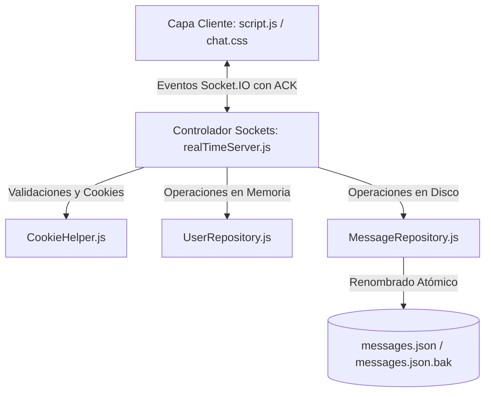

# INFORME TÉCNICO: REFACTORIZACIÓN ARQUITECTÓNICA Y RESILIENCIA TRANSACCIONAL
## Materia: Sistemas Distribuidos
**Proyecto:** ESPEChat (Servidor de Chat en Tiempo Real mediante WebSockets)

---

## 1. INTRODUCCIÓN
El presente informe documenta la refactorización arquitectónica y la implementación de mecanismos de resiliencia transaccional en la aplicación de mensajería en tiempo real **ESPEChat**. 

La versión original de la aplicación presentaba un alto acoplamiento, estado volátil almacenado en memoria principal (propenso a la pérdida total de información ante fallos de energía) y un modelo de comunicación de red de tipo *"dispara y olvida"* (fire-and-forget), el cual no garantizaba la entrega ni persistencia de los mensajes. 

Para resolver estas limitaciones, se aplicaron principios de diseño de software limpio y estructurado (**SOLID**) y se simularon propiedades transaccionales **ACID** (Atomicidad, Consistencia, Aislamiento y Durabilidad) sobre archivos de texto plano para garantizar la consistencia física de los datos.

---

## 2. OBJETIVOS
*   **Refactorizar la arquitectura del sistema** aplicando el principio de **Responsabilidad Única (S de SOLID)**, separando la lógica de la red (WebSockets) de la persistencia de datos (disco).
*   **Implementar resiliencia física** en el almacenamiento local mediante escrituras atómicas de tipo *Write-Swap* para evitar la corrupción de archivos JSON.
*   **Establecer un control de concurrencia** que ordene secuencialmente las escrituras en disco y evite colisiones de datos (condiciones de carrera) entre usuarios simultáneos.
*   **Desarrollar un protocolo de comunicación robusto** basado en respuestas de confirmación (**ACK**) y retransmisión gráfica desde el cliente en caso de fallos.

---

## 3. ARQUITECTURA PROPUESTA Y PRINCIPIOS SOLID
Inspirados en los patrones de código limpio explicados en clase (`cleansolid`), se migró de un modelo monolítico a una **arquitectura por capas**:



### Principios SOLID Aplicados:
1.  **Single Responsibility Principle (SRP - Responsabilidad Única):** Cada módulo tiene un único motivo de cambio. `realTimeServer.js` solo gestiona conexiones de socket, `MessageRepository` solo gestiona archivos en disco, y `UserRepository` solo administra sesiones efímeras.
2.  **Liskov Substitution Principle (LSP) y Open/Closed Principle (OCP):** Las capas se comunican mediante métodos limpios y genéricos (`loadAll`, `save`, `add`, `remove`). Si en el futuro se desea cambiar el almacenamiento de archivos JSON locales a una base de datos distribuida (ej. Redis o MongoDB), solo se debe sustituir la implementación interna del repositorio, manteniendo intacta la lógica de sockets.

---

## 4. IMPLEMENTACIÓN DE LA RESILIENCIA TRANSACCIONAL (ACID)

Para asegurar la durabilidad y consistencia de los mensajes almacenados, se implementaron técnicas a nivel de archivo que imitan el comportamiento de un gestor de base de datos relacional:

### A. Atomicidad (All-or-Nothing) mediante Write-Swap
La escritura directa con `fs.writeFile` es vulnerable; un fallo del servidor a mitad de escritura deja un JSON incompleto y corrupto. Para evitarlo:
1.  Los mensajes se escriben en un archivo temporal intermedio (`messages.json.tmp`).
2.  Se realiza una copia de respaldo del archivo actual (`messages.json.bak`).
3.  Se ejecuta la función `fs.rename` para mover el temporal al original. El kernel del sistema operativo garantiza que el cambio de nombre de un archivo es una **operación atómica** (o ocurre por completo, o no ocurre nada).

### B. Control de Concurrencia (Consistencia)
Cuando múltiples usuarios envían mensajes de forma simultánea, los hilos de Node.js pueden intentar escribir al mismo archivo JSON al mismo tiempo, causando escrituras sucias o pérdida de datos.
*   **Implementación:** Se utiliza una cola secuencial mediante encadenamiento de promesas (`writeQueue`). Cada guardado se concatena a la cola previa, procesando de manera síncrona/secuencial las escrituras y garantizando el aislamiento de las transacciones.

### C. Tolerancia a Fallos y Autocuración
Si al iniciar la lectura del archivo principal `messages.json` se detecta corrupción de datos (error en `JSON.parse`), el sistema lo captura, lee de forma transparente el archivo de respaldo `.bak`, repara el archivo maestro corrupto y continúa operando de forma automática.

---

## 5. CÓDIGO CLAVE IMPLEMENTADO

### Capa de Persistencia: `MessageRepository.js`
*Ubicación:* `src/repositories/MessageRepository.js`
```javascript
const fs = require('fs').promises;
const path = require('path');

class MessageRepository {
  constructor(filePath) {
    this.filePath = filePath || path.join(__dirname, '../../data/messages.json');
    this.backupPath = `${this.filePath}.bak`;
    this.tempPath = `${this.filePath}.tmp`;
    this.writeQueue = Promise.resolve();
    
    // Inicialización segura del directorio
    const dir = path.dirname(this.filePath);
    const fsSync = require('fs');
    if (!fsSync.existsSync(dir)) {
      fsSync.mkdirSync(dir, { recursive: true });
    }
  }

  async loadAll() {
    try {
      return await this.safeReadFile(this.filePath);
    } catch (error) {
      try {
        const backupData = await this.safeReadFile(this.backupPath);
        await this.writeAtomic(backupData);
        return backupData;
      } catch (backupError) {
        return [];
      }
    }
  }

  async save(message) {
    return new Promise((resolve, reject) => {
      this.writeQueue = this.writeQueue
        .then(async () => {
          const messages = await this.loadAll();
          const newMessage = {
            id: `${Date.now()}-${Math.random().toString(36).substr(2, 9)}`,
            user: message.user.trim(),
            content: message.content.trim(),
            date: message.date || new Date().toLocaleTimeString()
          };
          messages.push(newMessage);
          await this.writeAtomic(messages);
          resolve(newMessage);
        })
        .catch((error) => reject(error));
    });
  }

  async writeAtomic(data) {
    const jsonString = JSON.stringify(data, null, 2);
    await fs.writeFile(this.tempPath, jsonString, 'utf8');
    try {
      const fileExists = await fs.access(this.filePath).then(() => true).catch(() => false);
      if (fileExists) {
        await fs.copyFile(this.filePath, this.backupPath);
      }
    } catch (err) {}
    await fs.rename(this.tempPath, this.filePath);
  }

  async safeReadFile(file) {
    try {
      const rawContent = await fs.readFile(file, 'utf8');
      if (!rawContent || rawContent.trim() === '') return [];
      return JSON.parse(rawContent);
    } catch (error) {
      if (error.code === 'ENOENT') return [];
      throw error;
    }
  }
}
```

### Protocolo de Sockets del Servidor: `realTimeServer.js`
*Ubicación:* `src/realTimeServer.js`
```javascript
const CookieHelper = require("./utils/cookieHelper");
const MessageRepository = require("./repositories/MessageRepository");
const UserRepository = require("./repositories/UserRepository");

module.exports = (httpServer) => {
  const { Server } = require("socket.io");
  const io = new Server(httpServer);
  
  const messageRepository = new MessageRepository();
  const userRepository = new UserRepository();
  let typingUsers = [];

  io.on("connection", async (socket) => {
    // Cláusula de Guarda para cookies
    const cookieHeader = socket.request.headers.cookie;
    const currentUser = CookieHelper.get(cookieHeader, "username");
    
    if (!currentUser) {
      socket.disconnect(true);
      return;
    }

    userRepository.add(currentUser);
    socket.emit("connected", { name: currentUser });
    
    // Carga de historial al conectar
    try {
      const messageHistory = await messageRepository.loadAll();
      socket.emit("history", messageHistory);
    } catch (historyError) {}
    
    io.emit("updateUserCount", { count: userRepository.count() });

    // Mensajería transaccional con ACK
    socket.on("message", async (payload, callback) => {
      let content = payload?.content || payload;
      let clientMsgId = payload?.clientMsgId || null;

      if (!content || content.trim() === "") {
        if (typeof callback === "function") callback({ success: false, error: "Mensaje vacío" });
        return;
      }

      try {
        const savedMsg = await messageRepository.save({ user: currentUser, content });
        io.emit("message", { ...savedMsg, clientMsgId });
        
        if (typeof callback === "function") callback({ success: true, id: savedMsg.id });
      } catch (error) {
        if (typeof callback === "function") callback({ success: false, error: error.message });
      }
    });

    // Escritura y desconexión
    socket.on("typing", () => {
      if (!typingUsers.includes(currentUser)) typingUsers.push(currentUser);
      io.emit("updateTyping", { typingUsers });
    });

    socket.on("stopTyping", () => {
      typingUsers = typingUsers.filter((user) => user !== currentUser);
      io.emit("updateTyping", { typingUsers });
    });

    socket.on("disconnect", () => {
      userRepository.remove(currentUser);
      typingUsers = typingUsers.filter((user) => user !== currentUser);
      io.emit("updateTyping", { typingUsers });
      io.emit("updateUserCount", { count: userRepository.count() });
    });
  });
};
```

### Capa Cliente: Envío con ACK y Control de Reintentos
*Ubicación:* `src/public/js/script.js`
```javascript
function sendMessage() {
  const messageText = messageInput.value.trim();
  
  if (messageText !== '') {
    const clientMsgId = `client-${Date.now()}-${Math.random().toString(36).substr(2, 9)}`;
    
    // UI Optimista (Mensaje temporal)
    renderMessage({ user: currentUsername, content: messageText }, 'sending', clientMsgId);
    
    // Emisión con Callback (ACK)
    socket.emit('message', { content: messageText, clientMsgId }, (ack) => {
      handleServerAck(clientMsgId, ack);
    });
    
    messageInput.value = '';
    isCurrentlyTyping = false;
    socket.emit('stopTyping');
  }
}

function handleServerAck(clientMsgId, ack) {
  const el = document.querySelector(`[data-client-id="${clientMsgId}"]`);
  if (!el) return;

  if (ack && ack.success) {
    el.classList.remove('sending', 'failed');
    if (ack.id) el.setAttribute('data-id', ack.id);
  } else {
    el.classList.remove('sending');
    el.classList.add('failed');
    const errorIndicator = el.querySelector('.error-indicator');
    if (errorIndicator) {
      errorIndicator.style.display = 'block';
      errorIndicator.innerText = `⚠️ Falló persistencia. Clic para reintentar.`;
    }
  }
}
```

---

## 6. PROTOCOLO DE RED CON RETRANSMISIÓN Y RECUPERACIÓN

Para combatir la inestabilidad de red inherente a los entornos de sistemas distribuidos, se implementó el siguiente flujo de estados:

1.  **Estado Enviando (Transitorio):** El mensaje local se muestra con opacidad. Representa una transacción local pendiente de sincronización con el estado global distribuido.
2.  **Conciliación de Estado:** Al recibir la difusión del servidor (`message`), el emisor utiliza el `clientMsgId` para emparejar el elemento DOM temporal con la confirmación de la base de datos, retirando el estilo transitorio.
3.  **Transacción Fallida (Fallback):** Si la base de datos remota/disco falla, el servidor responde con un código de error en el ACK. El emisor actualiza el estilo de forma no bloqueante a fallido (`.failed`) en rojo.
4.  **Reintento Semántico:** Al hacer clic en un mensaje fallido, el cliente dispara la transacción con el **mismo** identificador temporal, previniendo duplicados innecesarios en la base de datos.

---

## 7. CONCLUSIONES
*   La estructuración de un sistema de sockets bajo principios **SOLID** mitiga el acoplamiento y facilita la migración hacia otras tecnologías de persistencia en el futuro.
*   Simular comportamiento transaccional **ACID** sobre archivos planos usando el sistema operativo (`fs.rename` atómico) y colas asíncronas en Node.js garantiza la integridad del sistema ante apagados de emergencia o fallos de red.
*   El protocolo de comunicación con confirmación **ACK** de WebSockets provee un canal seguro y confiable de intercambio, otorgándole resiliencia de red al cliente.
